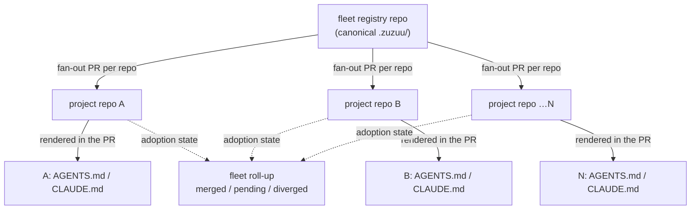

# Solo Builder Camp — requirements

## Summary

An OSS, zero-compute zuzuu orchestrator that lets a solo builder govern their own
fleet of repos. A canonical `.zuzuu/` lives in a dedicated fleet registry repo,
publishes to every project repo as fan-out pull requests the builder batch-merges,
and renders each host's `AGENTS.md`/`CLAUDE.md` from `.zuzuu/` — so one publish kills
convention drift across the fleet, for any agent. It runs entirely on the builder's
own GitHub App and (fast-follow) their own Fly; zuzuu holds no compute and no data.

## Problem Frame

A solo builder with ~5–20 of their own repos — side projects, client work, OSS
packages — now maintains per-repo AI-agent configuration: `AGENTS.md`, `CLAUDE.md`,
`.cursorrules`, guardrails. `AGENTS.md` became the de-facto universal format in
2025–26, so there is finally a shared artifact worth centralizing, and nothing
centralizes it. Today the builder hand-copies a refined convention from one repo to
the rest: roughly 18 minutes per update, with propagation misses several times a
quarter. The field offers fleet-*runners* (gita, ghorg — git convenience, no
governance) and enterprise portals (Backstage — explicitly not for individuals);
nobody delivers cross-repo *governance* at solo scale. The window before GitHub,
Cursor, or Sourcegraph build this in is roughly 12–18 months.

The camp is also the free OSS on-ramp in the tier strategy
(`docs/specs/2026-06-22-tiered-architecture.md`): it rehearses the deferred paid Pro
(hosted) and Enterprise (team governance) tiers using the same mechanics, so a builder
who later hires a team graduates with no relearning.

## Key Decisions

- **Zero zuzuu compute, BYO everything.** zuzuu is a pure orchestrator — a local
  binary/daemon the builder runs. Compute, hosting, and data are the builder's own
  (their GitHub, their Fly, their terminal agent). Nothing real traverses a zuzuu
  server (the Flightcontrol "pure control-plane" posture).
- **State lives in git plus a local SQLite; credentials in the builder's env.** The
  repos (registry + projects) are the orchestration database — sessions are already
  git branches, generations already content-addressed. A local SQLite holds only
  ephemeral in-flight/job state. No vendor backend.
- **The governed surface is the entire `.zuzuu/` subtree.** Everything in `.zuzuu/`
  is the admin's domain — the unit of publish, the audit boundary, and the GitHub-App
  access scope.
- **Governance leads v1; hosted workspaces fast-follow.** The cross-repo rule-
  governance loop is the undefended white space and the wedge. BYO-Fly workspaces are
  designed but ship after v1, and are the eventual Pro conversion lever.
- **Publish is a fan-out PR per repo, batch-merged; the merge is the gate.** The
  builder owns the repos, yet the camp still opens a PR into each and the builder
  batch-merges — preserving the human gate, a full git audit, and a 1:1 rehearsal of
  the Enterprise tier.
- **A dedicated fleet registry repo is the canonical source**, mirroring the
  Enterprise org-registry exactly.
- **`.zuzuu/` renders to host steering files, in v1.** The camp generates each repo's
  `AGENTS.md`/`CLAUDE.md`/`.cursorrules` from its `.zuzuu/`, so a publish reaches the
  universal drift pain — for any agent, not only zuzuu users. This is net-new (zuzuu
  today grounds sessions via an injected digest and writes no host steering files).
  The generated files are the one place the camp writes outside `.zuzuu/` — a
  deliberate trade for hitting the felt pain.
- **The builder is both admin and user**, collapsing the Enterprise admin/user split
  into one person governing their own fleet.
- **A hand-edited host file is overwritten on the next publish, surfaced in the PR
  diff.** No three-way-merge engine — the PR diff is the gate, so the builder sees the
  overwrite before merging (R13's marker makes the drift visible).

## Actors

- A1. The solo builder — one human; both the fleet *admin* (authors and publishes the
  canonical `.zuzuu/`) and the *user* (works in the project repos).
- A2. The user-owned GitHub App — created and owned by the builder via the manifest
  flow; grants the camp scoped access to the registry and project repos and mints
  short-lived per-run installation tokens. No webhook.
- A3. The terminal agent(s) — Claude Code, Codex, etc. — which read the host steering
  files the camp renders. Observed, never driven by zuzuu.
- A4. The repos — one fleet registry repo (canonical `.zuzuu/`) plus N project repos
  (the fleet).

## Key Flows

- F1. One-time GitHub App setup
  - **Trigger:** builder runs setup for the first time.
  - **Steps:** the CLI starts an ephemeral localhost server bound to 127.0.0.1 on a
    random port, carrying a random `state` token; opens the browser to GitHub's
    app-creation page pre-filled with a manifest (scoped permissions, no webhook); the
    builder confirms, creating the app under their own account; GitHub redirects to
    localhost with a code; the CLI validates `state`, exchanges the code for the private
    key, stores it (per R3) + the app/installation ids, and shuts the server down after
    the first callback.
  - **Outcome:** the builder owns a GitHub App; zuzuu never holds the key.
  - **Covered by:** R4, R5.
- F2. Author and publish a fleet convention
  - **Trigger:** builder updates a module in the registry repo and publishes.
  - **Steps:** the camp diffs the canonical `.zuzuu/` against each project repo; opens
    a PR into each carrying the `.zuzuu/` change plus the regenerated host files;
    presents a fleet-wide diff and a batch-merge control; the builder reviews and
    batch-merges the clean repos, resolving conflicts per repo.
  - **Outcome:** every adopted repo carries the new convention in both `.zuzuu/` and
    its host steering files.
  - **Covered by:** R7, R8, R9, R12, R13.
- F3. Adoption roll-up
  - **Trigger:** builder opens the fleet view.
  - **Steps:** the camp reads PR state and `.zuzuu/` content across the project repos
    via the GitHub App, and renders a per-module breakdown of merged / pending /
    diverged.
  - **Outcome:** fleet consistency at a glance; the audit trail is the git/PR history.
  - **Covered by:** R10, R11, R14.
- F4. Launch a BYO-Fly workspace (fast-follow)
  - **Trigger:** builder launches a hosted workspace for a repo.
  - **Steps:** the camp provisions a Fly Machine in the builder's own Fly account
    (via the existing `Backend` seam) running the daemon over that repo; the browser
    workbench connects.
  - **Outcome:** a hosted workbench on the builder's own compute; zuzuu runs none.
  - **Covered by:** R15.

## Requirements

**Orchestrator posture (zero-compute, BYO)**

- R1. zuzuu ships as a local binary/daemon the builder runs; it holds no builder
  compute and no builder data — all compute, hosting, and persistence are the
  builder's own.
- R2. Orchestration state persists in git (the registry and project repos) plus a
  local SQLite for ephemeral in-flight/job state; there is no zuzuu-hosted backend.
- R3. Credentials (the GitHub App private key, the Fly token) live in the builder's
  own environment; zuzuu reads them at runtime and never transmits them. The private
  key is stored in the OS keychain where available (a 0600-permission file fallback,
  with a warning, otherwise), and `zz camp reset` rotates and revokes it. The Fly token
  must be a minimally-scoped deploy token — not an account-wide PAT — never written to
  a tracked file or passed as a visible process argument.

**GitHub App (user-owned)**

- R4. The builder creates and owns a GitHub App via the manifest flow; setup completes
  in one guided pass without the builder hand-copying a private key.
- R5. The App registers with no webhook; the camp mints a short-lived installation
  token per run, scoped to the repos and permissions a given operation needs.
- R6. The camp confines all writes to `.zuzuu/**` plus the rendered host files (R12);
  the boundary is enforced in zuzuu's own code, since GitHub tokens cannot scope to a
  path within a repo. Enforcement is a deny-by-default allowlist check at the write
  boundary, evaluated before any GitHub API call and unit-tested; every PR enumerates
  the files it touches outside `.zuzuu/`.

**Fleet governance (the v1 wedge)**

- R7. A dedicated fleet registry repo holds the canonical `.zuzuu/` and is the single
  source the camp publishes from. v1 treats it as a normal repo containing a single
  `.zuzuu/`; per-project overrides are deferred.
- R8. Publishing fans out one pull request per project repo carrying the `.zuzuu/`
  diff; the project owner's merge is the gate — the camp never force-applies.
- R9. The camp presents a fleet-wide diff and a batch-merge control so the builder
  reviews and merges many repos in one pass; conflicts surface per repo for manual
  resolution.
- R10. The camp shows an adoption roll-up across the fleet: per published module,
  which repos have merged, are pending, or have diverged.
- R11. The audit trail is the git and PR history of the registry and project repos;
  the camp keeps no separate record.

**Host projection (in v1)**

- R12. On publish, the camp renders each repo's host steering files (`AGENTS.md`,
  `CLAUDE.md`, `.cursorrules`) from that repo's `.zuzuu/`, so the convention reaches
  any agent — not only zuzuu users. These generated files are the one thing the camp
  writes outside `.zuzuu/`. The renderer treats `.zuzuu/` content as untrusted input
  (no interpolation that can escape the expected schema), and the full rendered output
  appears in the PR diff for human review before merge.
- R13. Each rendered host file carries a generated-by marker — its load-bearing role —
  so a human hand-edit is detectable as drift; rendering is otherwise deterministic
  from `.zuzuu/`.

**Command center**

- R14. The fleet surfaces (registry, project repos, adoption roll-up, publish) extend
  the existing local workbench rather than a separate hosted UI.

**Hosted workspaces (fast-follow, not v1)**

- R15. The builder can launch a hosted workbench for a repo, provisioned into their
  own Fly account via the existing `Backend` seam; zuzuu runs no compute. (BYO-Fly
  per-user provisioning — token-binding, per-user instance attribution, and lifecycle —
  is a medium workstream, not a thin integration; see Dependencies.)

## Acceptance Examples

- AE1. **Covers R8, R9.** When the builder publishes a module and 8 of 10 repos apply
  cleanly while 2 conflict, the camp opens 10 PRs, batch-merges the 8 clean ones, and
  surfaces the 2 conflicts for manual resolution — never force-applying.
- AE2. **Covers R12, R13.** When `.zuzuu/instructions` changes, each repo's PR carries
  the regenerated `AGENTS.md`/`CLAUDE.md` (with a generated-by marker) alongside the
  `.zuzuu/` diff.
- AE3. **Covers R10.** When module X was offered to 10 repos and 6 merged, 3 are
  pending, and 1 diverged, the roll-up shows 6 / 3 / 1 with links to each PR.
- AE4. **Covers R6.** When a publish would write a path outside `.zuzuu/**` other than
  an allowlisted rendered host file, the camp refuses the write.
- AE5. **Covers R15.** When the builder launches a workspace for a repo, the camp
  provisions a Fly Machine in the builder's own Fly account, boots the daemon on it,
  and the browser workbench connects — with no zuzuu-side compute involved.

## Scope Boundaries

**Deferred for later**

- Hosted BYO-Fly workspaces (R15) — designed; a fast-follow after the governance v1.
- Projection to hosts beyond the common files (`AGENTS.md`/`CLAUDE.md`/`.cursorrules`)
  — start with the common set.
- A promote-from-any-repo publish flow — registry-first for v1.

**Outside this product's identity (the on-ramp boundary — these are the paid tiers)**

- Anything zuzuu-hosted: a managed registry, zuzuu-run compute, a hosted control-plane
  — that is Pro.
- Team / multi-user / multi-admin governance, SSO/SCIM, and a team roll-up dashboard —
  that is Enterprise.
- The camp must never require a zuzuu account or any zuzuu-side storage; the moment it
  does, it is no longer the OSS camp.

## Dependencies / Assumptions

- The GitHub App manifest flow, webhook-optional apps, and per-run installation tokens
  are official GitHub capabilities; the localhost-redirect setup works for a CLI with
  no hosted backend.
- The `.zuzuu/`→host-file projection is net-new. zuzuu today grounds a session by
  injecting a digest into the agent's live context (`src/cli/enable.mjs`,
  `src/hosts/hook.mjs`) and writes no host steering files; v1 must build the renderer.
- The Fly `Backend` seam (`create(token)` / `destroy(instanceId)`, `flyBackend`) in
  `web/cloud/broker/src/backends.ts` is the foundation for R15, but it currently
  targets the pre-rebuild layout and is anonymous-disposable; the BYO-Fly per-user
  model is additional work.
- No multi-repo, GitHub-App, or remote-git code exists today
  (`src/sessions/session-git.mjs` documents "never push, never touch remotes"); the
  solo-fleet orchestration is entirely net-new.
- The brain is git-native (`src/notes/store.mjs`, `src/sessions/session-git.mjs`,
  `src/grow/snapshot.mjs`), so git-as-orchestration-database is the literal
  architecture, not an analogy.

## Outstanding Questions

**Resolve before planning**

- The rendered-host-file allowlist: R12 writes generated files outside `.zuzuu/`. Pin
  the exact set of generated paths (root-level `AGENTS.md`/`CLAUDE.md`/`.cursorrules`
  only, or nested) so R6's enforcement is precise.

**Deferred to planning**

- What the local SQLite holds and where it lives (job/lock state shape).
- Token-minting cadence and per-run caching.

## Deferred / Open Questions

### From 2026-06-22 review

- **PR-per-repo gate — friction or gate? (R8)** For a solo owner who merges their own
  PRs, validate whether the gate's value (audit, Enterprise rehearsal) outweighs the
  per-update ceremony; consider a direct-apply escape hatch for trusted repos.
  *(product-lens, adversarial — re-opens a Key Decision)*
- **Lead the Problem Frame with Enterprise-rehearsal?** The build cost dwarfs the
  quantified solo pain (~18 min/quarter); the honest primary driver may be de-risking
  the deferred Enterprise tier. Decide whether to reframe. *(product-lens)*
- **Treat the host-file projection as a separable bet?** R12 turns zuzuu into a
  steering-file owner (host-format churn + hand-edit reconciliation, indefinitely) —
  the highest-trajectory commitment in the doc. Confirm it belongs in v1 vs a
  fast-follow. *(product-lens)*
- **Enumerate R14's v1 command-center surface.** Name the views added (fleet roll-up,
  batch-merge control) and what is explicitly not added, to bound UI scope.
  *(scope-guardian)*
- **Define R2's local-SQLite minimum scope** (e.g., a publish lock + PR-id→repo mapping
  for batch-merge), or mark it requirements-TBD. *(scope-guardian)*

## Sources / Research

- `docs/specs/2026-06-22-tiered-architecture.md` — the Pro + Enterprise tier strategy
  this is the OSS on-ramp to (the campaign/burn-down roll-up, the GitHub-App-scoped-to-
  `.zuzuu/**` model, the merge-is-the-gate governance workflow).
- Substrate the camp builds on: `web/cloud/broker/src/backends.ts` (Fly `Backend`
  seam), `src/notes/store.mjs` / `src/sessions/session-git.mjs` / `src/grow/snapshot.mjs`
  (git-native brain), `src/cli/enable.mjs` / `src/hosts/hook.mjs` (current digest
  grounding — the projection R12 replaces/extends).
- External prior art (for the planner): the GitHub App **manifest flow** + webhook-
  optional apps + per-run installation tokens (official GitHub docs; Renovate-self-
  hosted is the structural precedent); the BYO-infra **git-as-database + local SQLite +
  creds-in-env** pattern (SST/Pulumi, ArgoCD/Flux GitOps, Flightcontrol's pure-control-
  plane posture); the cross-repo **AGENTS.md-drift white space** (gita ~1.9k stars,
  Backstage explicitly not-for-individuals, ~18 min/update propagation cost); the
  **open-core wedge** mechanics (give solo governance free, convert on operator-burden /
  team-features / cloud-convenience — GitLab, PostHog, Coder, n8n).
